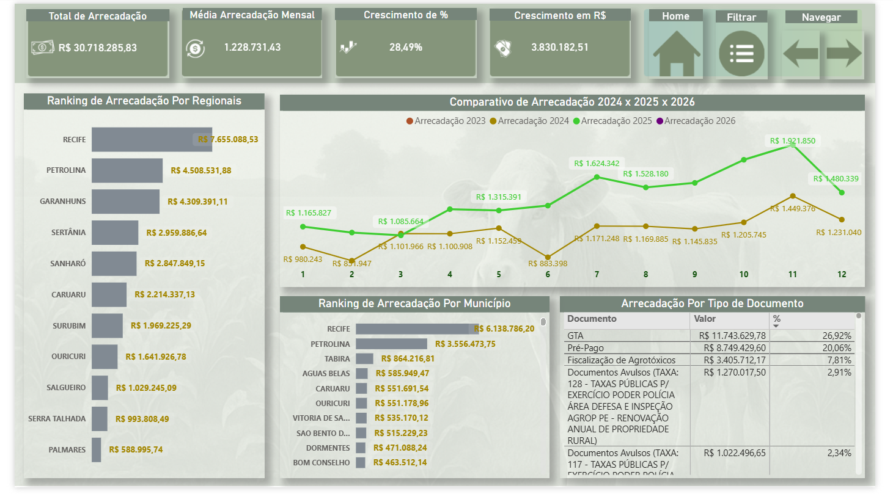
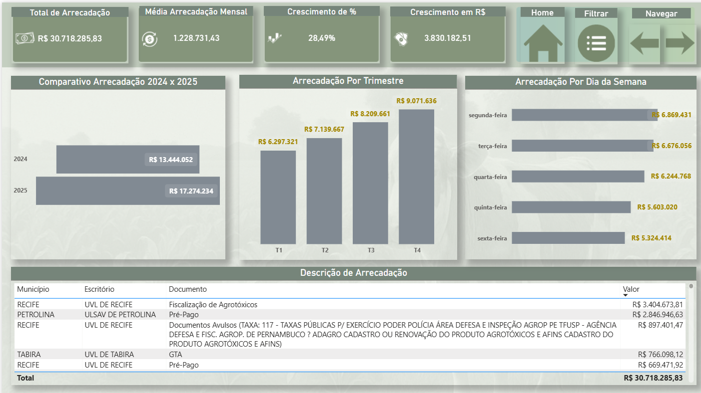

# 📊 Revenue Analytics – Arrecadação Pública por Região e Documento

Dashboard desenvolvido em Power BI para análise estratégica de arrecadação, com foco em crescimento, distribuição regional e performance por tipo de documento.

---

## 📌 Problema de Negócio

A gestão não possuía uma visão consolidada da arrecadação, dificultando a identificação de padrões, crescimento e distribuição regional da receita.

---

## 💡 Solução Desenvolvida

Desenvolvimento de um dashboard interativo em Power BI permitindo:

- Monitoramento da arrecadação total e média mensal
- Análise de crescimento percentual e absoluto
- Comparativo entre anos (2023 a 2026)
- Ranking por regionais e municípios
- Análise por tipo de documento

---

## 🏗️ Estrutura do Dashboard

O dashboard foi organizado em três camadas:

- **Visão Executiva (Home)**
- **Análise Detalhada**
- **Filtros Dinâmicos**

---

## 📊 Indicadores

- Total arrecadado
- Média mensal
- Crescimento (%)
- Crescimento (R$)
- Ranking por região
- Ranking por município

---

## 🧠 Insights

- Crescimento consistente ao longo dos anos
- Concentração de receita em regiões específicas
- Relevância de determinados tipos de documentos
- Variação mensal indicando sazonalidade

---

## 🧭 Funcionalidades

- Navegação entre páginas
- Filtros por ano, mês, regional e município
- Interatividade entre gráficos

---

## 🛠️ Tecnologias

- Power BI
- DAX
- Power Query

---

## 📷 Dashboard

### Página Principal

### Análise

### Filtros

---

## 🚀 Aplicação Prática

Este dashboard permite:

- Identificar regiões mais relevantes
- Acompanhar crescimento
- Apoiar decisões estratégicas

---

## 📌 Conclusão

Projeto focado na transformação de dados em informação estratégica para apoio à decisão.
